# DNS Tunneling Detection System

[](https://opensource.org/licenses/MIT)
[](https://www.python.org/downloads/)
[](https://www.docker.com/)

Enterprise-grade DNS tunneling detection system using machine learning and autonomous security agents. Real-time detection, automated response, and comprehensive monitoring for covert DNS exfiltration attempts.

## Overview

DNS tunneling is a sophisticated attack technique where malicious actors encode data within DNS queries to bypass traditional security controls. This system employs machine learning and behavioral analysis to detect such attacks in real-time, providing automated alerting and response capabilities.

### Key Features

- 🤖 **Machine Learning Detection** - Isolation Forest algorithm with 96.5% accuracy on normal traffic
- 🔄 **Real-Time Analysis** - Sub-second query processing with streaming analytics
- 📊 **Interactive Dashboard** - Streamlit-based visualization with scenario simulation
- 🚨 **Multi-Channel Alerting** - Slack, Microsoft Teams, Email, JIRA integration
- 🔧 **Automated Response** - Configurable blocking and incident creation
- 📈 **Production Monitoring** - Grafana dashboards with Prometheus metrics
- 🔄 **Automated Retraining** - Weekly model updates with validation
- 🐳 **Cloud-Native** - Fully containerized with Docker Compose

## Architecture


## Detection Pipeline


## Quick Start

### Prerequisites

- Docker Engine 20.10+
- Docker Compose 2.0+
- 8GB RAM minimum
- Ports 3000, 5432, 8000, 8501, 9090 available

### Installation

```bash
# Clone repository
git clone https://github.com/SandyK43/DnsTunnel.git
cd DnsTunnel

# Start all services
docker-compose up -d

# Wait for services to initialize (30 seconds)
sleep 30

# Train the ML model
docker-compose exec api python scripts/train_model.py \
    --format sample --num-samples 5000

# Verify services
docker-compose ps
```

### Access Points

| Service | URL | Credentials |
|---------|-----|-------------|
| **Interactive Demo** | http://localhost:8501 | None |
| **API Documentation** | http://localhost:8000/docs | None |
| **Grafana Dashboard** | http://localhost:3000 | admin / admin123 |
| **Prometheus Metrics** | http://localhost:9090 | None |

## System Components

### Core Agents

#### Feature Extraction Agent
Analyzes DNS queries and extracts 10 statistical features:

- Shannon entropy
- Query length and label count
- Maximum label length
- Character distribution (digits, non-alphanumeric)
- Temporal patterns (queries per second, unique subdomains)

```python
from agents.feature_extractor import FeatureExtractor

extractor = FeatureExtractor()
features = extractor.extract_features(
    query="suspicious123abc.example.com",
    client_ip="192.168.1.100"
)
```

#### Anomaly Scoring Agent
ML-based anomaly detection using Isolation Forest:

```python
from agents.scorer import AnomalyScorer

scorer = AnomalyScorer(
    model_path="models/isolation_forest.pkl",
    threshold_suspicious=0.70,
    threshold_high=0.85
)
score, severity = scorer.score(features)
```

#### Alert Manager
Multi-channel notification system with configurable thresholds:

```python
from agents.alerting import AlertManager

alert_mgr = AlertManager()
await alert_mgr.send_alert(
    domain="malicious.example.com",
    client_ip="10.0.1.50",
    score=0.92,
    severity="HIGH",
    features=features
)
```

### API Endpoints

#### Analyze DNS Query
```bash
curl -X POST http://localhost:8000/api/v1/dns/analyze \
  -H "Content-Type: application/json" \
  -d '{
    "query": "www.example.com",
    "client_ip": "192.168.1.100"
  }'
```

#### Get Statistics
```bash
curl http://localhost:8000/api/v1/stats | jq
```

#### List Alerts
```bash
curl http://localhost:8000/api/v1/alerts?severity=HIGH | jq
```

## Configuration

### Environment Variables

Edit `.env` to configure system behavior:

```bash
# Detection Thresholds
ANOMALY_THRESHOLD_SUSPICIOUS=0.70
ANOMALY_THRESHOLD_HIGH=0.85

# Automated Response
ENABLE_AUTO_RESPONSE=false

# Logging
LOG_LEVEL=INFO

# Database
POSTGRES_DB=dns_tunnel_db
POSTGRES_USER=dnsadmin
POSTGRES_PASSWORD=changeme123

# Notifications
SLACK_WEBHOOK_URL=https://hooks.slack.com/services/YOUR/WEBHOOK
EMAIL_SMTP_HOST=smtp.gmail.com
EMAIL_TO=security-team@company.com
```

### Alerting Channels

#### Slack Integration
```bash
SLACK_WEBHOOK_URL=https://hooks.slack.com/services/T00/B00/XX
docker-compose restart api
```

#### Email Alerts
```bash
EMAIL_SMTP_HOST=smtp.gmail.com
EMAIL_SMTP_PORT=587
EMAIL_FROM=alerts@company.com
EMAIL_TO=security@company.com
EMAIL_USERNAME=your-email@gmail.com
EMAIL_PASSWORD=your-app-password
```

#### JIRA Tickets
```bash
JIRA_URL=https://your-company.atlassian.net
JIRA_USERNAME=your-email@company.com
JIRA_API_TOKEN=your-api-token
JIRA_PROJECT_KEY=SEC
```

## Model Training

### Automated Weekly Training

The system includes automated weekly model retraining:


Setup automated training:
```bash
docker-compose exec api /app/scripts/setup_weekly_training.sh
```

### Manual Training

Train on custom data:
```bash
# Train on Zeek logs
docker-compose exec api python scripts/train_model.py \
    --format zeek \
    --input /path/to/dns.log

# Train on JSON logs
docker-compose exec api python scripts/train_model.py \
    --format json \
    --input /path/to/queries.json

# Generate sample data
docker-compose exec api python scripts/train_model.py \
    --format sample \
    --num-samples 10000
```

## Demo Scenarios

The interactive dashboard includes 5 realistic attack scenarios:

```mermaid
graph TD
    A[Select Scenario] --> B{Scenario Type}

    B -->|Normal Business Day| C[100 Benign Queries]
    B -->|Data Exfiltration| D[5 Phases: Normal → Prep → Exfil → Cover → Normal]
    B -->|Malware C2| E[5 Phases: Pre-infection → Beacon → Dormant → Command → Post]
    B -->|Insider Threat| F[4 Phases: Normal → Recon → Theft → Cleanup]
    B -->|Zero-Day Outbreak| G[5 Phases: Pre-outbreak → Infection → Spread → Peak → Containment]

    C --> H[Real-time Analysis]
    D --> H
    E --> H
    F --> H
    G --> H

    H --> I[Display Results]
    I --> J[Severity Distribution]
    I --> K[Remediation Actions]
```



Run scenarios at http://localhost:8501

## Monitoring

### Grafana Dashboards

Pre-configured dashboards for:
- Query volume and severity distribution
- Detection performance metrics
- System health and resource usage
- Alert history and trends

Access: http://localhost:3000 (admin / admin123)

### Prometheus Metrics

Exposed metrics:
- `dns_queries_total` - Total queries processed
- `dns_queries_by_severity` - Queries by severity level
- `dns_detection_latency` - Processing time histogram
- `dns_alerts_total` - Alert counts by severity

Access: http://localhost:9090

## Security Considerations

### Production Deployment

⚠️ **Before deploying to production:**

1. Change default passwords in `.env`
2. Configure TLS/SSL certificates
3. Set up firewall rules (allow only necessary ports)
4. Enable authentication on all services
5. Configure backup strategy for PostgreSQL
6. Review and test alert channels
7. Document incident response procedures
8. Set up log aggregation and retention

See [docs/DEPLOYMENT_CHECKLIST.md](docs/DEPLOYMENT_CHECKLIST.md) for complete checklist.

### Threat Model

This system detects:
- ✅ DNS tunneling via dnscat2, iodine
- ✅ Data exfiltration through DNS
- ✅ Command and control (C2) via DNS
- ✅ Malware beaconing patterns
- ✅ High-entropy subdomain encoding

This system does NOT prevent:
- ❌ DDoS attacks
- ❌ DNS cache poisoning
- ❌ DNS amplification attacks
- ❌ Malicious domains (use blocklists instead)

## Documentation

- [Quick Start Guide](docs/QUICKSTART.md) - Get running in 5 minutes
- [Demo Script](docs/DEMO_SCRIPT.md) - Presentation walkthrough
- [Automated Retraining](docs/AUTOMATED_RETRAINING.md) - ML model maintenance
- [Deployment Checklist](docs/DEPLOYMENT_CHECKLIST.md) - Production readiness
- [Project Summary](docs/PROJECT_SUMMARY.md) - Technical overview

## Troubleshooting

### Services Won't Start

```bash
# Check if ports are in use
lsof -i :8000 -i :3000 -i :5432

# Check Docker resources
docker stats

# View service logs
docker-compose logs api
```

### Model Not Found

```bash
# Train the model
docker-compose exec api python scripts/train_model.py --format sample

# Verify model exists
docker-compose exec api ls -lh /app/models/
```

### High False Positive Rate

```bash
# Adjust thresholds in .env
ANOMALY_THRESHOLD_SUSPICIOUS=0.75  # Increase from 0.70
ANOMALY_THRESHOLD_HIGH=0.90        # Increase from 0.85

# Restart services
docker-compose restart api

# Retrain with more diverse data
docker-compose exec api python scripts/train_model.py \
    --format sample --num-samples 10000
```

### Database Connection Issues

```bash
# Check PostgreSQL status
docker-compose ps postgres

# View PostgreSQL logs
docker-compose logs postgres

# Verify connection string
docker-compose exec api env | grep DATABASE_URL
```

## Performance

### Benchmarks

Tested on MacBook Pro M1 (16GB RAM):

- **Query Processing**: < 10ms per query
- **Throughput**: 1000+ queries/second
- **Model Training**: ~5 seconds for 5000 samples
- **Memory Usage**: ~500MB total (all services)
- **Startup Time**: ~30 seconds cold start

### Scalability

For high-volume environments:
- Deploy multiple API instances behind load balancer
- Use PostgreSQL replication for read scaling
- Enable Redis caching for frequently queried data
- Consider Kafka for log ingestion pipeline

## Development

### Project Structure

```
DnsTunnel/
├── agents/              # Core detection agents
│   ├── feature_extractor.py
│   ├── scorer.py
│   ├── collector.py
│   └── alerting.py
├── api/                 # FastAPI REST API
│   ├── main.py
│   ├── routes.py
│   └── database.py
├── demo/                # Streamlit dashboard
│   └── streamlit_dashboard.py
├── scripts/             # Utilities and automation
│   ├── train_model.py
│   ├── automated_retraining.py
│   └── setup_weekly_training.sh
├── docs/                # Documentation
├── models/              # Trained ML models
├── data/                # Sample data
├── docker-compose.yml   # Container orchestration
├── Dockerfile           # Container definition
└── requirements.txt     # Python dependencies
```

### Running Tests

```bash
# Unit tests
docker-compose exec api pytest tests/

# Integration tests
docker-compose exec api pytest tests/integration/

# Performance tests
docker-compose exec api pytest tests/performance/ -v
```

### Contributing

1. Fork the repository
2. Create a feature branch (`git checkout -b feature/amazing-feature`)
3. Commit your changes (`git commit -m 'Add amazing feature'`)
4. Push to the branch (`git push origin feature/amazing-feature`)
5. Open a Pull Request

## License

This project is licensed under the MIT License - see the [LICENSE](LICENSE) file for details.

## Support

- **Documentation**: [docs/](docs/)
- **Issues**: [GitHub Issues](https://github.com/SandyK43/DnsTunnel/issues)
- **Discussions**: [GitHub Discussions](https://github.com/SandyK43/DnsTunnel/discussions)

## Acknowledgments

- Isolation Forest algorithm by Liu et al.
- Zeek Network Security Monitor
- FastAPI framework
- Streamlit visualization library
- Grafana and Prometheus monitoring stack

---

**⚠️ Disclaimer**: This system is designed for legitimate network security monitoring. Users are responsible for ensuring compliance with applicable laws and regulations. Unauthorized monitoring of network traffic may be illegal.
