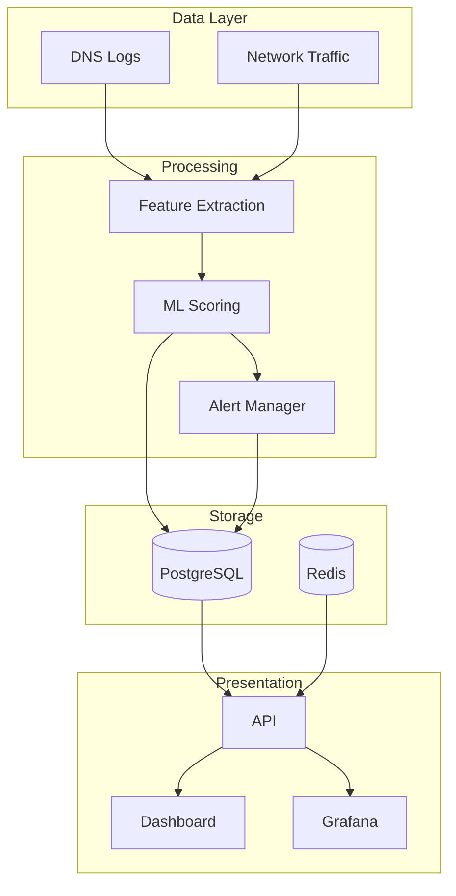
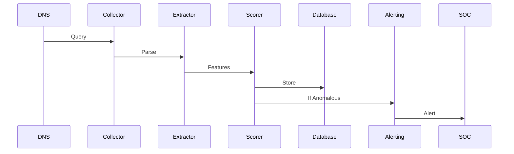

# Documentation Index

Complete documentation for the DNS Tunneling Detection System.

## Getting Started

### [Quick Start Guide](QUICKSTART.md)
Get the system running in 5 minutes with docker-compose. Includes basic usage, testing, and troubleshooting.

**Topics covered:**
- Installation and setup
- Training the ML model
- Running demo scenarios
- Accessing dashboards
- Basic configuration

---

## Operations

### [Automated Retraining](AUTOMATED_RETRAINING.md)
Weekly automated model retraining system with validation and human review.

**Topics covered:**
- Setup weekly cron jobs
- Training process workflow
- Model validation and deployment
- HTML report generation
- Notifications and alerts
- Model backup and rollback

---

## Deployment

### [Deployment Checklist](DEPLOYMENT_CHECKLIST.md)
Production deployment checklist with security hardening and best practices.

**Topics covered:**
- Security configuration
- Password management
- TLS/SSL setup
- Firewall rules
- Backup strategies
- Monitoring setup
- Performance tuning

---

## Demonstrations

### [Demo Script](DEMO_SCRIPT.md)
Step-by-step demonstration script for presenting the system (10-15 minutes).

**Topics covered:**
- Pre-demo setup
- Live attack simulation
- Dashboard walkthrough
- Alert demonstration
- Report generation
- Q&A preparation

---

## Technical Overview

### [Project Summary](PROJECT_SUMMARY.md)
Comprehensive technical overview of system architecture, components, and deliverables.

**Topics covered:**
- System architecture
- Core agents and components
- Feature engineering
- ML model details
- Integration points
- Technology stack

---

## Quick Reference

### Common Commands

```bash
# Start all services
docker-compose up -d

# Train model
docker-compose exec api python scripts/train_model.py --format sample

# View logs
docker-compose logs -f api

# Run demo scenario
# Open http://localhost:8501

# Check system health
curl http://localhost:8000/api/v1/health

# View statistics
curl http://localhost:8000/api/v1/stats | jq
```

### Service URLs

| Service | URL | Purpose |
|---------|-----|---------|
| Interactive Demo | http://localhost:8501 | Scenario simulation |
| API Docs | http://localhost:8000/docs | REST API reference |
| Grafana | http://localhost:3000 | Monitoring dashboards |
| Prometheus | http://localhost:9090 | Metrics explorer |

### Configuration Files

- `.env` - Environment variables and configuration
- `docker-compose.yml` - Service orchestration
- `config.yaml` - Application settings
- `requirements.txt` - Python dependencies

---

## Architecture Diagrams

### System Architecture



### Detection Flow



---

## Additional Resources

- **Main README**: [../README.md](../README.md)
- **GitHub Issues**: Report bugs or request features
- **GitHub Discussions**: Ask questions and share ideas

---

## Document Status

| Document | Status | Last Updated |
|----------|--------|--------------|
| Quick Start | ✅ Complete | 2025-11-25 |
| Automated Retraining | ✅ Complete | 2025-11-25 |
| Deployment Checklist | ✅ Complete | 2025-11-25 |
| Demo Script | ✅ Complete | 2025-11-25 |
| Project Summary | ✅ Complete | 2025-11-25 |

---

**Need help?** Check the [Quick Start Guide](QUICKSTART.md) or open an issue on GitHub.
